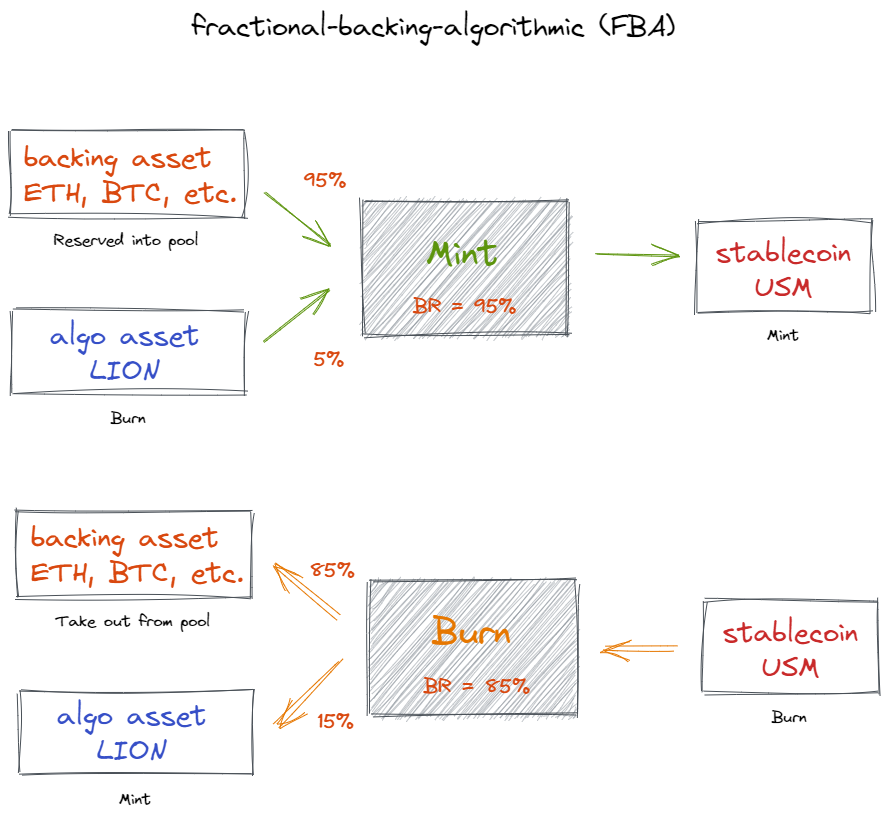
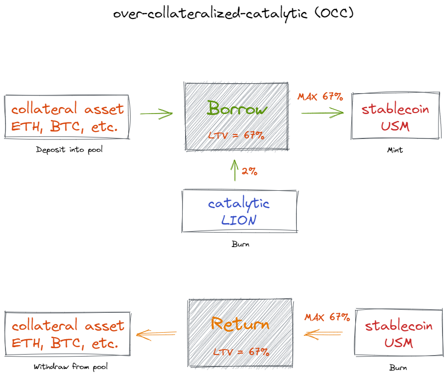

# The Next Gen Chain-native Stablecoin

This document describes the native stablecoin protocol of Merlion. {synopsis}

## Why Does the Crypto Need Another Stablecoin?

Stablecoin is the blood and water of the crypto world, and actually it is the basic medium for various on-chain trading,
capital flow and store of value. For the crypto will expand to a wider group of digital residents in the future, it must
have one or more stablecoins which serve as general equivalents and circulation medium.

Even though many kinds of stablecoins already exist in the crypto, due to their huge differences in classification of
mechanism and operation, one cannot conclude that one or a few of them can satisfy all application scenarios. Besides
centralized stablecoins, we have seen too many failures of some algorithmic stablecoins. Innovation of stablecoin will
never stop, and the endgame battle is yet to come.

The chain-native stablecoin of Merlion hopes to challenge many old competing projects and become one of the next
generation of stablecoin with innovative mechanisms. First, it will be a fully decentralized stablecoin that does not
rely on the 1:1 backing of centralized fiat currency. Second, it will be collateralized or backed by any selected
external cryptocurrency with good long-term value. Merlion stablecoins are not minted using just one method, but through
multiple approaches. We have determined two kinds of mintage at present: collateralized lending and backed swapping. In
the future, we do not rule out introducing other innovative mintage mechanisms, but the premise is that they are
sufficiently safe and reliable.

For Merlion stablecoin, we have now set a few core principles that need to be adhered to over the long term.

- The first principle is that **pure algorithmic mintage is not allowed**. We believe that pure algorithmic stablecoins
  have neither withstood the test of confidence nor made any practical sense from the past to the present. Generating
  assets out of thin air is indeed exciting but tantamount to short-sighted hemlock for the burgeoning crypto community.
- The second principle is to **mint on-demand and reject meaningless incremental issuance**. The pursuit of scale in the
  short term may be a huge pitfall that has already been planted in many DeFi projects over the past few years. Even
  well-designed tokenomics which make a project successful, should be restrained and rational to maintain steady upward
  growth, not exceeding actual demand, but should actually keep pace with the progress of the crypto world.
- The third principle is **sufficient decentralization and DAO governance**. For the next generation of stablecoin to
  become the native infrastructure building blocks of the crypto world, they must be gradually freed from the shackles
  of centralization and the influence of star founders or teams. Stablecoin is capable of realizing the original vision
  of Bitcoin - electronic cash - provided that the founders hand over the future to the crypto community at the right
  time, as Satoshi Nakamoto did.

In order to uphold the above principles and achieve our goals, Merlion stablecoin will be built on the innovative
DeFi-specific blockchain and become one of its two core tokens.

## The Minting and Burning Protocol

As mentioned above, we designed the Merlion stablecoin with the fundamental insistence that even if the stablecoin
deviates from its anchor price during extreme market volatility, the system is able to use its own well-established
mechanisms to automatically trigger or incentivize the price to return to the peg without relying on the intervention of
external human strategies.
For this reason, we have avoided becoming a pure algorithmic stablecoin. We have seen firsthand that the highly
respected and massively huge [Terra](https://terra.money) still cannot escape the spiral of collapse caused by targeted
sniping during extreme market conditions. The two kinds of minting/burning mechanisms for Merlion stablecoin (called Mer
USD or USM) are as follows.

### Fractional-Backing-Algorithmic (FBA)

This minting approach was actually invented by [FRAX](https://frax.finance), where minted stablecoins comes from partly backing asset and partly
algorithmic supply. We define the ratio of backing value to algorithmic value is called **BR (Backing Ratio)**.

What we need to highlight here is the algorithmic part. As mentioned above, pure algorithmic stablecoins are extremely
risky. However, as a native token that captures the value of the network, it makes sense for LION to participate in the
USM minting process, but the participation extent needs to be regulated by the system based on the current demand for
USM. Especially at the beginning of the network, we recommend setting the BR to 95%, which means that only $0.05 worth
of LIONs are allowed to be minted for 1 $USM. Formula follows:

```
For 0 < BR <= 1,
BackingValue = MintUSM * BR
LIONValue = MintUSM * (1 - BR)
```

When the market demand for USM rises, the system automatically decreases the BR value, allowing more LIONs to be burned
in the minting of USMs. When the market demand for USMs falls, the system automatically increases the BR value, allowing
fewer LIONs to be burned in the minting of USMs. In turn, USMs can be burned to swap for the reserved backing assets and
minted LIONs, again in a proportion controlled by the BR value.

This dynamic adaptive capability to changes in market demand absorbs the possible volatility of USM into the composition
of the reserving asset portfolio of the system pool. Any small disturbance is absorbed very quickly, avoiding the
accumulation of large fluctuations with consequences that the system cannot resist. We believe that the system's
worst-case response mechanism is the cornerstone of maintaining USM pegging.



### Over-Collateralized-Catalytic (OCC)

Overcollateralization is the most reliable and tried-and-true method of minting stablecoin, the most famous of which
is [DAI](https://makerdao.com). Over-collateralized assets can be volatile assets such as ETH and BTC, or other
stablecoin assets like USDC.

Overcollateralization means that the amount of the maximum mintable USMs must be less than the value of the
collateralized asset, and the ratio between them is called **LTV (Loan-To-Value)**. For example, if the LTV is 67% and
the collateral value is $100, then a maximum of 67 $USM can be minted. We also define the **Over-Collateralized Rate (OCR)**, which is equal to the reciprocal of the LTV; i.e., if the LTV is 67%, then the OCR is 150%.

We have made a slight change to the overcollateralization method by also defining **Basic LTV**, which is generally less
than LTV, i.e., the user can only mint USM at the Basic LTV ratio of the collateral value in the most basic case; if the
user wants to achieve the maximum LTV ratio, it must burn a certain amount of LION, which we call the ratio of the
maximum burned LION value to the minted USM value as **CLR (Catalytic Lion Ratio)**. Taking the previous example, with
an LTV of 67%, a Basic LTV of 45%, and a CLR of 2%, a user can mint a maximum of 45 $USM when the collateral value is
$100; if the user tries to mint 67 $USM, he needs to burn $67 * 2% = $1.34 worth of LIONs; if he tries to mint 55 $USM,
he needs to burn $55 * 2% * ( 55% - 45%) / (67% - 45%) = $0.5 value of LION, where the CLR involved in the calculation
is adjusted by the position of the actual LTV in a linear scale between the Basic LTV and the maximum LTV. The formula
is:

```
MaxUSM = CollateralValue * LTV
BasicUSM = CollateralValue * BasicLTV
For MintUSM, and BasicUSM < MintUSM < MaxUSM,
BurnedLIONValue = MintUSM * CLR * (MintUSM / CollateralValue - BasicLTV) / (LTV - BasicLTV)
```



## Oracle

Merlion has a built-in price oracle module that periodically accepts near real-time quotes from active staking
validators, and first removes outliers with large deviations, and then takes the median as the final true and fair
on-chain price. Since the Merlion stablecoin is anchored in $USD, the oracle quotes will also be denominated in $USD,
which is actually `$1 * 1e-6` given the need for some precision. The tokens to be quoted are first LION and USM, and
then all the asset tokens used to back or collateralize the stablecoin (e.g. ETH) will also need to be quoted. Merlion
encourages staking validators to take diversified market price sources that help the oracle's final quotes faithfully
reflect real market prices.

The price data from the oracle will be directly applied to the exchange rate calculations during the minting and burning
of USM, which is critical to the operation of the entire system and the pegging stability of USM. Therefore, Merlion
does not rule out the possibility of introducing quotes from professional oracles with sufficient credibility, such as
Chainlink, in the future.

## Monetary Policy

The supply and demand for stablecoins is invisibly regulated by the free market, with equilibrium prices targeting
pegged fiat currencies (e.g. USD), and generally works well, with both suppliers and demanders satisfying their trading
positions well. Merlion will have a good variety of configurable system-level parameters and will also have a range of
built-in adaptive monetary policies that are robust enough to deal with common bad cases. Merlion will be iteratively
upgraded to incorporate more and better auto-adjustment strategies as the USM becomes more widely used.

However, just as almost all software systems cannot respond to extreme situations in a very timely manner and always
make the very right changes, we cannot fully trust that established parameter auto-adjustment strategies will always
handle market extremes and even capital sniping well. Therefore, Merlion will also put into practice the role of DAO and
governance by encouraging highly experienced financial experts and even academic economists in the community to publish
proposals for forward monetary policy regulation or emergency proposals to deal with unexpected situations, and then
have the community vote on whether to adopt the governance proposals as a basis for regulating the monetary policy of
the Merlion stablecoin system.

## Diverse Application Scenarios with Sufficient Breadth and Depth

With the advent of the Web3 era, crypto technologies and protocols will be used in a wider and deeper variety of
scenarios, and we aim to make more people want to hold and use Merlion stablecoins in this wave sweeping the globe. USM
can be used as the basic exchange medium for various DeFi protocols or projects on the chain, as a circulating currency
within GameFi, and also used by NFT creators and collectors to value their NFTs. USM is inherently suited for pricing
and payment for data sharing and rentals in new Web3 social and information applications that emphasize user ownership
of data. USM does not exclude the connection to the offline world, but we believe it would be a sign of Merlion's
success to be one of the circulation currencies in the vast Web3 world of the future.
